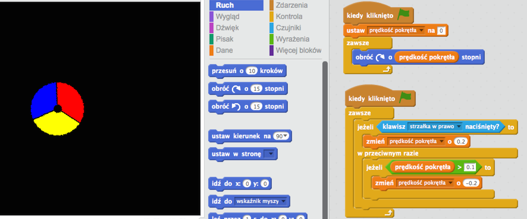
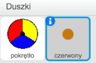
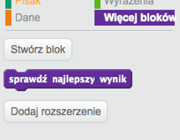
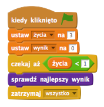

---
title: Catch the Dots
level: Scratch 2
language: pl-PL
stylesheet: scratch
embeds: "*.png"
materials: ["Club Leader Resources/*.*", "Project Resources/*.*"]
beta: true
...

# Wstęp { .intro }

Realizując ten projekt nauczysz się, jak stworzyć grę, w której musisz dopasować kolorowe kulki do odpowiedniej części pokrętła.

<div class="scratch-preview">
	<iframe allowtransparency="true" width="485" height="402" src="http://scratch.mit.edu/projects/embed/44942820/?autostart=false" frameborder="0"></iframe>
	
</div>

# Krok 1: Creating a controller { .activity }

Let's start by creating a controller, that will be used to collect dots.

## Zadania do wykonania { .check }

+ Stwórz nowy projekt i usuń duszka-kota, aby projekt był pusty.

+ For this project, you should have a 'Project Resources' folder, containing the controller image you can use. Make sure that you can find this folder, and ask your club leader if you can't find it.

	

+ From this 'Project Resources' folder, import 'controller.png' as a new sprite. If you don't have this image you can draw it yourself! You should also make the stage black. Here's how your stage should look:

	

+ You can move your controller really easily, by turning it left or right when the arrows are pressed:

	```blocks
		kiedy kliknięto zieloną flagę
		zawsze
			jeżeli <klawisz [left arrow v] naciśnięty?> to
				turn left (2) degrees
			koniec
			jeżeli <klawisz [strzałka w prawo v] naciśnięty?> to
				turn right (2) degrees
			koniec
		koniec
	```
+ Test out your controller -- it should spin left and right.

+ Although this code works, it would be much better if the controller sped up and slowed down gradually. To do this, delete the code you just created for your controller, and create a new variable called `controller speed` {.blockdata}.

+ Add this code to your controller, to make it repeatedly use the `controller speed` {.blockdata} to move:

	```blocks
		kiedy kliknięto zieloną flagę
		ustaw [controller speed v] na [0]
		zawsze
			turn right (controller speed) degrees
		koniec
	```

+ At the moment, this code won't move the controller, as the speed has been set to 0! Create a separate script in your controller that increases the speed when the right arrow is pressed.

	```blocks
		kiedy kliknięto zieloną flagę
		zawsze
			jeżeli <klawisz [strzałka w prawo v] naciśnięty?> to
				zmień [controller speed v] o (0.2)
			w przeciwnym razie

			koniec
		koniec
	```

+ Have you noticed that there's a gap in the code above? You will need to add some code to slow down the controller if the right arrow key isn't pressed. However, you only want to slow down the controller until the speed gets back down to 0, otherwise it'll start spinning backwards.

	Here's the code you should add:

	```blocks
	jeżeli <(controller speed) > [0.1]> to
		zmień [controller speed v] o (-0.2)
	end
	```

	Here's how your controller code should look:

	

+ Test your project again. If you hold down the right arrow key your controller should speed up. Let go of the key and your controller should gradually slow down.

## Zapisz swój projekt { .save }

## Wyzwanie: Spinning left {.challenge}
Duplicate the entire controller script for spinning to the right. Can you modify this duplicated code so that your controller spins to the left when the left arrow key is held down?

You'll need to change some of the numbers in the code! (Hint: the controller will spin to the left if the `controller speed` {.blockdata} variable has a negative value.)

## Zapisz swój projekt { .save }

# Krok 2: Collecting dots { .activity }

Let's add dots to the game that the player will collect with their controller.

## Zadania do wykonania { .check }

+ Create a new sprite called 'red'. This sprite should be a small red dot.

	

+ Add this script to your 'red' dot sprite, to create a new dot clone every few seconds:

	```blocks
		kiedy kliknięto zieloną flagę
		czekaj (2) s
		zawsze
			create clone of [myself v]
			czekaj (losuj od (5) do (10)) s
		koniec
	```

+ When each clone is created, you want it to appear in one of the 4 corners of the stage.

	

	To do this, first create a new list variable called `start positions` {.blockdata} and click the `(+)` to add in the values `-180` and `180`.

	

+ You can use these 2 list items to pick a random corner of the stage. Add this code to the 'dot' sprite, so that each new clone moves to a random corner and then slowly moves towards the controller.

	```blocks
		kiedy zaczynam jako klon
		idź do x: (item (random v) of [start positions v]) y: (item (random v) of [start positions v])
		point towards [controller v]
		pokaż
		powtarzaj aż <dotyka [controller v]?>]?
			przesuń o (1) kroków
		koniec
	```

	The code above chooses either `-180` or `180` for the x _and_ y positions, meaning that each clone starts in one corner of the stage.

+ Test your project. You should see lots of red dots appear in each corner of the screen, and move slowly towards the controller.

	

+ Create 2 new variables called `lives` {.blockdata} and `score` {.blockdata}.

+ Add code to your stage to set the `lives` {.blockdata} to 3 and the `score` {.blockdata} to 0 at the start of the game.

+ You need to add code to the end of your red dot's `kiedy zaczynam jako klon` {.blockcontrol} code, so that either 1 is added to the player's `score` {.blockdata} if the colours match, or 1 is taken from the player's `lives` {.blockdata} if the colours don't match.

	```blocks
		przesuń o (5) kroków
		jeżeli <dotyka koloru [#FF0000]?> to
			zmień [wynik v] o (1)
			zagraj dźwięk [pop v]
		w przeciwnym razie
			zmień [lives v] o (-1)
			zagraj dźwięk [laser1 v]
		koniec
		delete this clone
	```

+ Add this code to the end of your stage's script, so that the game ends when the player loses all of their lives:

	```blocks
		czekaj aż <(lives) < [1]>
		zatrzymaj [wszystko v]
	```

+ Test your game to make sure this code works as expected.

## Zapisz swój projekt { .save }

## Wyzwanie: More dots {.challenge}
Duplicate your 'red' dot sprite twice, and name the two new sprites 'yellow' and 'blue'.


Edit these sprites (including their code), so that each coloured dot has to match the correct colour on the controller. Remember to test your project, making sure you gain points and lose lives at the right times, and that your game isn't too easy or too hard!


## Zapisz swój projekt { .save }

# Krok 3: Increasing the difficulty { .activity .new-page}

Let's make the game get more difficult the longer the player survives, by slowly reducing the delay between dots appearing.

## Zadania do wykonania { .check }

+ Create a new variable called `delay` {.blockdata}.

+ On your stage, create a new script that sets the delay to a high number, and then slowly reduces the delay time.

	```blocks
		kiedy kliknięto zieloną flagę
		ustaw [delay v] na (8)
		powtarzaj aż < (delay) = (2)>
			czekaj (10) s
			zmień [delay v] o (-0.5)
		koniec
	```

	Notice that this is very similar to how a game timer works!

+ Finally, you can use this `delay` {.blockdata} variable in your red, yellow and blue dots' scripts. Remove the code that waits a random number of seconds between creating clones, and replace it with your new `delay` {.blockdata} variable:

	```blocks
		czekaj (delay) s
	```

+ Test your new `delay` {.blockdata} variable, and see whether the delay between dots reduces slowly. Does this work for all 3 coloured dots? Can you see the value of the `delay` {.blockdata} variable reducing?

## Zapisz swój projekt { .save }

## Wyzwanie: Faster moving dots {.challenge}
Can you improve your game by adding a `speed` {.blockdata} variable, so that the dots start off moving 1 step at a time, and steadily get faster and faster? This will work in a very similar way to the `delay` {.blockdata} variable used above, and you can use this code to help you.

## Zapisz swój projekt { .save }

# Krok 4: High score { .activity }

Let's save the high score, so that players can see how well they're doing.

## Zadania do wykonania { .check }

+ Create a new variable called `high score` {.blockdata}.

+ Click on your stage, and create a new custom block called `check high score` {.blockmoreblocks}.

	

+ Just before the end of the game, add in your new custom block.

	

+ Add code to your custom block to store the current `score` {.blockdata} as the `high score` {.blockdata} `if` {.blockcontrol} it's the highest score so far:

	```blocks
		definiuj [check high score]
		jeżeli <(score) > (high score)> to
			ustaw [high score v] na (score)
		koniec
	```

+ Test the code you've added. Play your game to check whether the `high score` {.blockdata} is updated correctly.

## Zapisz swój projekt { .save }

## Wyzwanie: Improve your game! {.challenge}
Can you think of ways to improve your game? For example, you could create special dots that:

+ double your score;
+ slow down the dots;
+ hide all the other dots on the screen!

## Zapisz swój projekt { .save }

## Wyzwanie: Game menu {.challenge}
Can you add a menu (with buttons) to your game? You could add an instructions screen, or a separate screen for showing the high score. If you need help with this, the 'Brain Game' project will help you.
